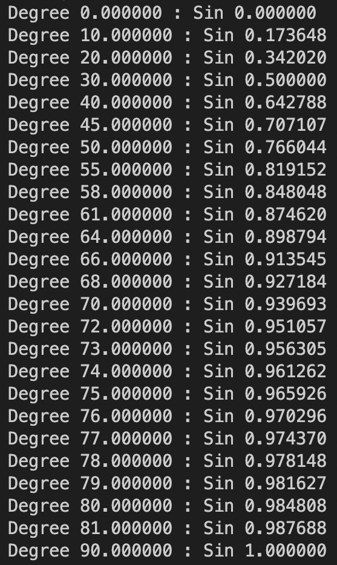
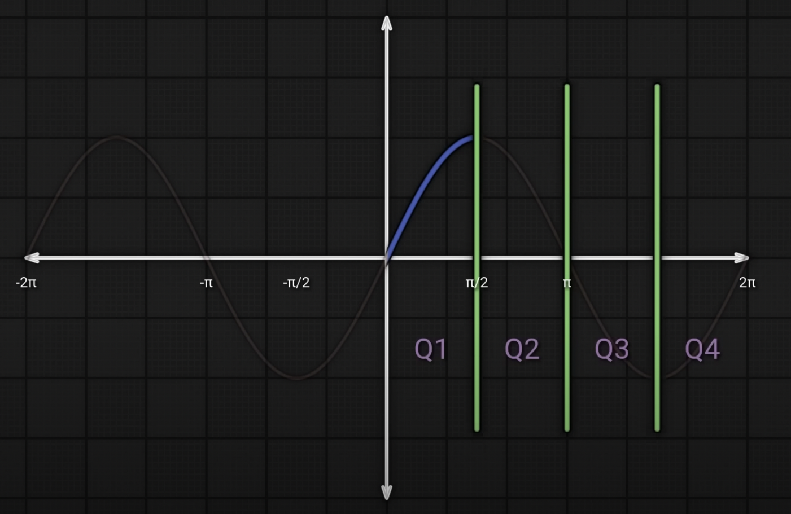

# TrigApproxLERP

TrigApproxLERP is a library for approximating trigonometric functions using [linear interpolation (LERP)](https://en.wikipedia.org/wiki/Linear_interpolation).
<br>
## How It Works

This library uses a lookup table to cache key-value pairs of angles and sine ratios. Using this table and some basic trigonometric identities, it can approximate values for both trig and inverse trig expressions. For example, $\cos(\theta) = \sin(\theta + 90\degree)$ and $\tan(\theta) = \sin(\theta)/\sin(\theta + 90\degree)$. The library converts all trig expressions in terms of sine and indexes through the table until it finds the given angle and returns a linear approximation for the ratio. For inverse trig values, $\sin^{-1}(ratio)$ equals some $\theta$ stored in the table. With an inverse lookup, the library indexes through the table until it finds the given ratio and returns a linear approximation of the angle.
<br>
## The Lookup Table

A lookup table is a collection that stores precalculated pairs of values so that during runtime, the program can simply index a value in the table rather than compute it.

<br>
<p align="center">

</p>
<br>

Angles up to 90 degrees and their respective sine ratios are stored. This is because the function for sine follows a symmetrical pattern that repeats every 90 degrees. That is, $\sin(180\degree - \theta) = \sin(\theta)$ where $\theta \in (90\degree, 180\degree]$, $\sin(\theta - 180\degree) = -\sin(\theta)$ where $\theta \in (180\degree, 270\degree]$, and $\sin(360\degree - \theta) = -\sin(\theta)$ where $\theta \in (270\degree, 360\degree]$.

<br>
<p align="center">

</p>
<br>

Calculating ratios for an angle $\theta$ not stored in the table requires linear interpolation, where the weighted midpoint of two angles stored in the table, one less than $\theta$ and one greater, is returned. In the above table, when calculating $\sin(42\degree)$, the table indexes the sine value for $40\degree$: $0.642788$, and $45\degree$: $0.707107$. The weighted midpoint between these two values for $42\degree$ would be $0.6685156$, which is within $0.1$% of the true value. For an angle $\theta$ outside $[0, 90\degree]$, $\theta$ is converted into an equivalent angle within this range and the ratio is negated if the original angle fell in the last two quadrants. For example, when calculating $\sin(-400\degree)$, the angle is converted into its positive form of $320\degree$ and is then converted into $40\degree$. The resulting ratio calculated would be negated, since $320\degree$ is in Quadrant $IV$, to produce a ratio of $-0.642788$.
<br>
## How The Lookup Table Is Populated

In order to perform linear interpolation on uncached angles, the line between the two points opposite the angle in the lookup table must be close to linear. Perfect linearity is impossible, since the tangential slope along the function $\sin(x)$ is always changing, but it is possible to separate the function into intervals where the slope remains close to constant. To do this, the user must provide three parameters when constructing a lookup table: an incrementer, a decrementer, and an accuracy threshold. Before adding a pair of values to the table, the library checks to see if by adding the incrementer to the last angle recorded, the difference in slope between this new angle's and the previous angle's sine ratios exceeds the given accuracy threshold. If it does, the incrementer is decreased by the amount specified by the decrementer and the process starts again. If the slope is within this threshold, then the line between these two points is close to linear, and the pair is added to the table. A graphical explanation of this process can be found [here](https://www.desmos.com/calculator/8uxmsoepce). The smaller the parameters provided are, the more accurate the calculations will be, but with the cost of increased computation time.
<br>
## Library Usage

### Functions
```c
// Generate Lookup Table
double **populateLookupTable(double incrementer, double decrementer, double threshold);

// Base Functions - pass the default (incrementer: 0.02, decrementer: 0.01, threshold: 0.01) as parameters
double approxSin(double angle);
double approxCos(double angle);
double approxTan(double angle);

// Custom Functions - specify parameters
double approxSinCustom(double angle, double incrementer, double decrementer, double threshold);
double approxCosCustom(double angle, double incrementer, double decrementer, double threshold);
double approxTanCustom(double angle, double incrementer, double decrementer, double threshold);

// Table Functions - calculations using a previously generated lookup table
double approxSinWithTable(double **arr, double angle);
double approxCosWithTable(double **arr, double angle);
double approxTanWithTable(double **arr, double angle);

// Base Inverse Functions - pass the default (incrementer: 0.02, decrementer: 0.01, threshold: 0.01) as parameters
double approxInvSin(double angle);
double approxInvCos(double angle);
double approxInvTan(double angle);

// Custom Inverse Functions - specify parameters
double approxInvSinCustom(double angle, double incrementer, double decrementer, double threshold);
double approxInvCosCustom(double angle, double incrementer, double decrementer, double threshold);
double approxInvTanCustom(double angle, double incrementer, double decrementer, double threshold);

// Table Inverse Functions - calculations using a previously generated lookup table
double approxInvSinWithTable(double **arr, double angle);
double approxInvCosWithTable(double **arr, double angle);
double approxInvTanWithTable(double **arr, double angle);

```

### Single Use
```c
approxSin(60) 
```
```c
approxInvCosCustom(1/sqrt(2), 0.01, 0.05, 0.007) // 0.07 represents a 0.7% accuracy threshold
```

### Multiple Use
```c
double **arr = populateLookupTable(0.01, 0.05, 0.007);
approxSinWithTable(arr, 60);
approxInvCosWithTable(arr, 1/sqrt(2));
```
When calculating multiple values, it is most efficient to generate a lookup table once and use it for all calculations. Only use multiple lookup tables if you need different accuracy thresholds for calculations.
<br>
## Notes

1. <math.h>'s built-in sin() function was used to generate the lookup table. In the real world, the lookup table would be generated before the program starts and the library would only use the table to calculate values.


2. This library is not optimized for speed, and is only intended for demonstration purposes. It is not recommended to use this library for any serious applications.
<br>

### Authored by [Suhas Guddeti](https://github.com/Suhas44)